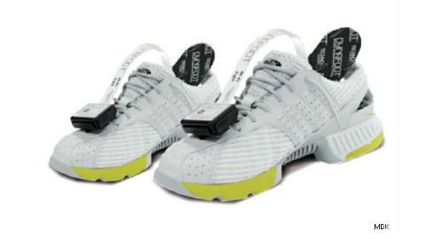
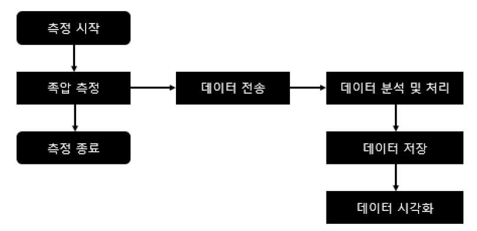
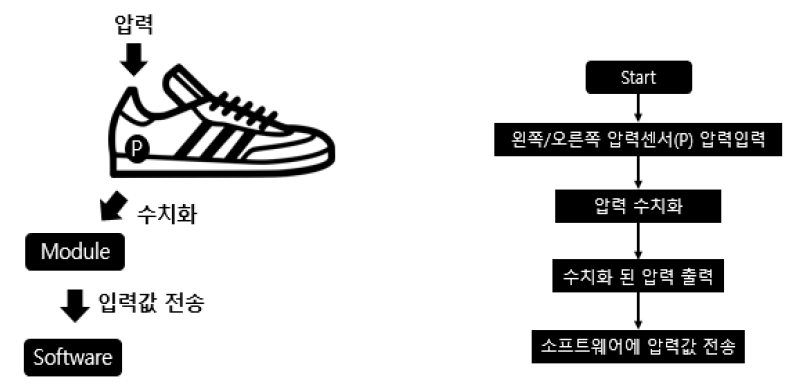
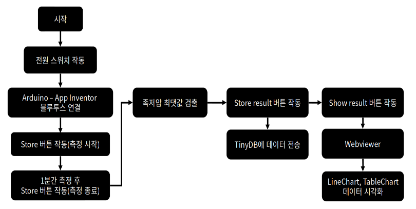

# Project : Scolosis Tracking Shoes

- Project name : Scolosis observation project using foot pressure 
- Participation : Jeong Seok Gyu(201724570, PNU), Lee Doo Gyeong(201724525, PNU) 
- Proudct name : Scolosis tracking shoes 

# 1. Summarization 

|About product|Contents|
|:---:|:---| 
|Project name|Scolosis observation project using foot pressure| 
|Introduction|The foot pressure measurement device is a device that can measure the static foot pressure of a user, measure dynamic walking, and anlyze it, and is a user-friendly and easy to move. Within the project, a foot pressure measurement device was used to track the deepening and mitigration of scolosis, which is cost-effective compared to follow-up observation using conventional imaging equipment by measuring pressure differences in both feet. This work stores pressure sensor data measured through Bluetooth communication between Android and Apps in a smartphone, manipulates it through buttons in App Inventor application, and provides visualization plots with 2D Line chart and Table chart.| 
|The background and necessity| The number of patients with spinal diseases in Korea is steadily increasing. Among them, in the case of scolosis, follow-up observation using imaging equipment is emphasized. The need for a device for managing scolosis that team members are actually experiencing is reconsidered.| 
|The characteristics and advantages|We store the data obtained in real time through pressure sensor inside the database inside the application and provide a visualization plot for scolosis observation. It is a device that can observe the degree of scolosis through a simple self-measurement method without using an expensive device.| 
|The contents of the project|The work is divided into hardware and software parts. In the case of hardware, the pressure is measured through an FSR sensor, and the measured value is transmitted using Arduino's Bluetooth module. In particular, ArduinoIDE converts it into ADC units through the analogRead function and sends it to the application. In the software, the application was written through the App Inventor. The measured data is received in real time through Bluetooth communication, measured, and then the maximum pressure values of the measured pressures are extracted through a maximum-average value algorithm, calculated, and stored in TinyDB. In addition, visualization plots of stored data were provided as 2D Line-chart and Table-chart through the Google WebView API.|
|The expected effects and utilizations of the project|There is no need to move to medical institution to measure foot presure data through the product, so there are no spartial restrictions. Accessibility was improved using graph and charts to make it easire to interpret data by using user mobile devices.| 

# 2. Main text 

## 2.1 Overview 

### 2.1.1 Introduction

- Foot pressure measuring device 
  - A foot pressure measuring device is a device capable of measuring the static foot pressure of a user and measuring and analyzing dynamic walking, and is user-friendly and easy to move. 
  - It is used for body shape and posture analysis through static foot pressure and dynamic walking pressure measurement, walking analysis, static balance, foot pressure distribution, maximum pressure test of each foot, and body center measurement. 
  - Within the project, a foot pressure measurement device is used to track cost-effective scolosis deepening and mitigation compared to follow-up using conventional imaging equipment by measuring pressure differences in both feet. 
  - In other words, a device that allows patients with scolosis to receive treatement and direction through daily observation records and consultation through quantitative records. 
  
 
 
- Intention of the project 
  - The spartial disease is a disease that must be costantly managed. 
  - If care is negelected, pain may worsen or deveop into other spinal diseases. 
  - Management of spinal disease is mainly performed by follow-up using imaging equipment, but must be taken be visiting the hospital. 
  - The object of project is to develop a device that can track and observe spinal diseases through simple self-measurement without using expensive devices. 
  
- Contents of the project 
  - Store pressure sensor data measured by Bluetooth communication between Android and MCU in a smartphone database. 
  - Operate buttons on App Inventor application to provide visualization plots with 2D Line chart and Table chart. 
  
### 2.1.2 The background and necessity 

- An increase in the number of patients with sipnal diseases
  - As of 2015, the number of patients with spinal diseases in Korea was about 8.08 million, and as of 2020, the number of patitents with spinal disease in Korea was about 9.20 million, an increase of about 1.12 million(13%) over five years. 
  - In particular, the increase in patients with spinal diseases in the 20s was about 19%, the steepest increase in all age groups. 
  - Rapid growth in patients with spinal diseases in the 20s is influenced by increased use of potable IT devices and sitting time in incorrect posture and reduced exercise. 
  
- Diagnostic methods and management of scolosis 
  - Scolosis confirms its degrees through the Cobb angle using imaging equipment. The Cobb angle is the angle formed by a parallel line in the vertebrae located at either end of the curve and perpendicular to each line. 
  - According to the treatment policy of the Americal Scolosis Research Society, it is classified into observation, adjuvant, and surgical stages according to the degree. For the observation and adjuvant stages, the periodic follow-up based on imaging equipment and its recording is emphasized. 
  
- A team member's spinal disease
  - In the case of team member, Seok-Gyu Jeong, has scolosis with 22 degree. He has been steadily managed since the ocuurence of lumber pain in 2018. 
  - Scolosis is a typical disease that develops into herinated disc if management is neglected. 
  - Therefore, the need for a device to manage a disease directly experienced by team members is reconsidered.
  
### 2.1.3 The characteristics and advantages 

- The characteristics of a work 
  - The real-time data obtained through pressure sensors is transmitted to mobile devices via Bluetooth communication, and scolosis quantified by calculating the maximum average of the pressures of each foot. 
  - Provides a 2D Lie chart and Table chart visualization plot to store foot pressure sensor data measured for the user's desired time inside the application database and observe scolosis.
  
- The advantages of a work 
  - A device that can track and observe the degree of scolosis through a simple self-measurement method without using an expensive device. 
  - Measure pressure on both feet to facilitate periodic management of quantitative data. 
  - Continuous observations allow for earlier and faster observation and management of scolosis than imaging equipmenet. 

## 2.2 The contents of the project 

### 2.2.1 The composition diagram

- S/W composistion diagram 
  - Measured foot pressure data is received inside the application via Bluetooth communication. 
  - After filtering the foot pressure data of both feet based on the 700 ADC value, only the maximum value is extracted. Calculate the average value of the extracted maximum value and store it in the left maximum averaged pressure value and the rigth maximum averaged pressure value variable, respectively. 
  - Store data, username, left maximum averaged pressure, right maximum averaged pressure, and difference value in the TinyDB database. 
  - When the visualization button is pressed in the application, the visualization plot is provided in the form of 2D Line-chart, Table chart. 
  

- H/W composition diagram 
  - User puts on the device, then turns on the device. 
  - Converts the pressure input to the pressure sensor into ADC units through an analog to digital function inside the MCU 
  - $ADC = \frac{V_p \times 1024}{V_{REF}}$, $V_p$ = Input voltage of selected pin, $V_{REF}$ = Input voltage. 
  - Transmitted the converted pressure value to the App Inventor application via Bluetooth communication. 

- System composistion diagram 
  - User wears device, operates application to enable application Bluetooth communication with Arduino. 
  - Measure the foot pressure data via the Start button and exit the measurement via the Stop button. 
  - Calcualtes data to be automatically stored in the database within the application. The calculated data calculates the average value of the maximium values for the pressures of each foot and the difference of their values. 
  - Store analyzed data in the TinyDB database via the Store result button. 
  - Press the Show result button to check the 2D Line-chart and Table chart according to the username through the GoogleWebView API. 

### 2.2.2 The functions

- List of functions 

| Sortion | Functions | Explainations | Current Progress (%) | 
|:---:|:---:|:---|:---:| 
|S/W|Preprocessing and storing data|Arduino receives data sent to the application via Bluetooth communication and stores it inside the database|100|
|S/W|Maximum - average value calculation algorithm for both foot pressure| Filter values below 700 ADC inside the application, then extract maximums and calculate averaged values|100| 
|S/W|Provides a visualization plot of 2D Line-chart, Table chart to observe the trend of scolosis|Provides visualization plots of data stored inside the database into line graph and table through the Google WebView API|100| 
|H/W|Pressure measurement|Measure the pressure using the FSR sensor and transmit the measured value using Arduino's Bluetooth module|100| 
|H/W|ADC conversion and Bluetooth communication|ArduinoIDE convert signal into ADC units via analogRead function, and sends data to Bluetooth via ArduinoBLE library|100| 

- Functions of S/W 

|Functions|Explainations| 
|:---:|:---|
|Preprocessing and storing data|The application was created through the App Inventor. Among them, data calculated through algorithms are stored in TinyDB in the form of [user name, date, left foot pressure measurement, right foot pressure measurement, difference value]| 
|Maximum - average value calculation algorithm for both foot pressure| 
|Provides a visualization plot of 2D Line-chart|If user press the Stop button to exit the measurement, removing values below 700(ADC). Afterwards, the maximum values are extracted based on a condition greater than the value of the previous index and the value of the subsequent index. Calculates and stores the average value of the extracted maximum value| 
|Provides a visualization plot of 2D Line-chart, Table chart to observe the trend of scolosis|Press the Show result button to TinyDB table by username sent to Google WebView API. Inside the GoogleWebViewAPI LineChart.html, visualizing inside the application via the TableChart.html file provides plots| 

- The UI of the application is largely composed of an operation part and a visualization part. The UI of the operation part is separated into 3 parts. The top part is the Bluetooth communication connection part, which allows users to connect to Arduino by installing an ArduinoBLE extension in the app inventory. 
- The central part consists of five buttons. Measurement is started through the Start button, measurement is started through the Start button, and data is preprocessed. The Rest button allows the measured results to be initialized. Store the result button store the data in the form of [username, date, left foot presure measurement, right foot pressure measurement, difference value] in the TinyDB database inside the App Inventor. Afterwards, Show the result button moves screen to visulization UI. 
- The visualization screen extracts data from the TinyDB database and provides visualization plots with 2D Line-chart and Table chart through the Google WebView API. 

- Function of H/W 

|Functions|Explainations| 
|:---:|:---| 
|Pressure measurement|Measure the pressure using the FSR sensor, MS9709, and transmit the measured value using Arduino's Bluetooth module|  
|ADC conversion and Bluetooth communication| ArduinoIDE convert signals into ADC unit via analogRead function. Data is sent via Bluetooth using the ArduinoBLE library|

### 2.2.3 They key application techniques

- Pressure sensor 
  - Pressure sensor are a type of variable resistance that decreases when the pressure increases; i.e. the circuit measures the variable pressure resistance using conductance. 
  - As the pressure applied to the pressure sensor increases, the value of the measured voltage also increases. 
  - The pressure sensor used in the project is FSR sensor, MS9709, which is recognized an ADC vlaue in the range 0 to 1023 by the analog to digital function within the program. 

- ADC units 
  - $ADC = \frac{V_p \times 1024}{V_{REF}}$, $V_p$ = Input voltage of selected pin, $V_{REF}$ = Input voltage.
  - The value of the voltage applied to the pressure sensor in the hardware is quantified to calculate ADC units for use within the software. The received voltage will be calculated by replacing it with 0V = 0.0 ADC and 3.3V = 1023 ADC. 1 ADC value will have a value of approximately 0.003V. 
  - Can be calculated automatically by using the analogRead() function inside the ArduinoIDE. 

- Maximum-mean value calculation algorithm 
  - After a Bluetooth connection is made between Arduino and the application, the measured values are accumulated in the list of left and right pressure variables. Upon completion of the measurement, each variable list is cycled to take a value greater than the 700 ADC value and take the previous and subsequent values as the maximum value and store them in the maximum pressure variable list. 
  - The aveage value of the maximum values stored in the list of maximum pressure variables is then calculated, stored in the left maximum pressure avreage and the right maximum pressure average variable, and the difference value is calcualted. 
### 2.2.4 The development environments

### 2.2.5 Other considerations

## 2.3 The project performance 

### 2.3.1 Participations' division of work 

### 2.3.2 Project execution scehdule 

### 2.3.3 Problems and solutions in the project implementation

### 2.3.4 The things i get through the project 

## 2.4 The expected effects and utilizations of the project 

## 2.4.1 The expected effects 

## 2.4.2 The utilizations 

## 2.5 Development outputs 
                                                                   
